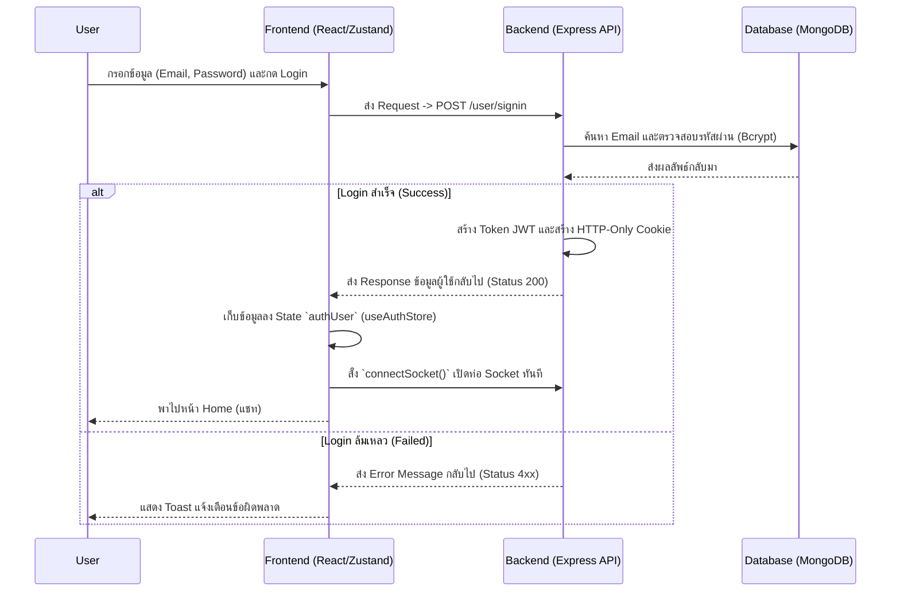
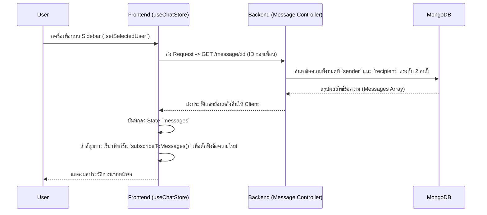
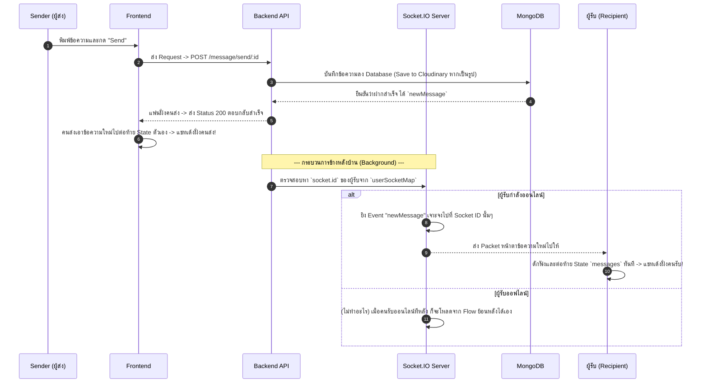
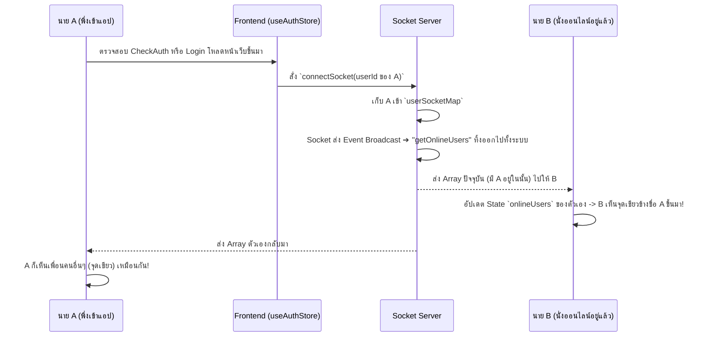

# 🔄 System Flow - MERN-CHAT 

เอกสารนี้อธิบายลำดับการทำงาน (Flow) หลักภายในโปรเจกต์ MERN-CHAT เพื่อให้เห็นภาพรวมว่าข้อมูลวิ่งจาก Client (React) ไปยัง Server (Node.js/Express) และเชื่อมต่อกับ Database (MongoDB) อย่างไร 

---

## 1. 🔐 Flow การล็อคอินและการยืนยันตัวตน (Authentication Flow)
ทุกครั้งที่ผู้ใช้งานจะเข้าสู่ระบบหรือเปิดแอปพลิเคชัน จะต้องผ่าน Flow นี้ก่อนเสมอ

---

## 2. 💬 Flow การดึงประวัติการแชท (Chat History Flow)
เมื่อผู้ใช้กดเลือกแชทกับเพื่อนจาก Sidebar ทางซ้าย ระบบจะไปดึงประวัติการคุยเก่าๆ ของทั้งคู่ออกมา

---

## 3. 🚀 Flow การส่งข้อความแบบ Real-time (Real-time Messaging Flow)
หัวใจสำคัญของโปรเจกต์คือ เมื่อพิมพ์ข้อความแล้ว อีกฝั่งต้องเห็นทันทีโดยไม่ต้อง Refresh ส่วนนี้จะใช้ **REST API คู่กับ Socket.IO**

---

## 4. 🟢 Flow สถานะผู้ใช้งาน (Online Status Flow)
เมื่อเสียบสาย Socket.IO สำเร็จฝั่ง Server จะ Broadcast เพื่อบอกชาวบ้านว่าใครออนไลน์บ้าง

---

## 📌 สรุปหลักการไหลของข้อมูล (General Rules)
- ข้อมูลจำพวกการดึงข้อมูลตั้งต้น (Fetch data), แก้ไขโพรไฟล์, เลื่อนประวัติ ลงคลัง (Persistence) ทั้งหมดจะยิงผ่าน **REST API** (axios)
- ข้อมูลที่มีการยิงแจ้งเตือน ข้อมูลที่วิ่งเข้ามาแทรกแบบด่วนจี๋ (Notification, Chat) ทั้งหมดจะวิ่งผ่านท่อ **Socket.IO** (Listen to events)
- **Zustand** เสมือนตัวกลางบัญชาการ ที่เมื่อรับของมาจาก API หรือ Socket แล้ว จะเก็บลงกล่อง (State) แล้วกระจาย (Render) ให้ทุก Component หน้าเว็บเห็นข้อมูลชุดเดียวกันทันที
